Spline plot demonstration
================
Lars Mølgaard Saxhaug
12/16/2021

``` r
library(tidyverse) 
library(here) # helpful for file referencing
library(mgcv) # GAM package
library(gratia) # ggplot based plotting of GAMs
library(brms) # bayesian modelling
library(tidybayes) # integrating brms into a tidyverse workflow
library(carData) # source for data
options(contrasts = c("contr.treatment","contr.treatment")) # simple treatment contrasts for ordinal variables
```

``` r
df <- TitanicSurvival %>% 
  mutate(sex=as.factor(sex),
         passengerClass=as.ordered(passengerClass), 
         survived=as.numeric(as.factor(survived))-1) %>% #code survie as numeric 0 1
  drop_na(age)
```

``` r
simpmod <-  gam(survived~sex+passengerClass+s(age,by=sex,bs="tp",pc=50),family = binomial,data = df)

summary(simpmod)
```

    ## 
    ## Family: binomial 
    ## Link function: logit 
    ## 
    ## Formula:
    ## survived ~ sex + passengerClass + s(age, by = sex, bs = "tp", 
    ##     pc = 50)
    ## 
    ## Parametric coefficients:
    ##                   Estimate Std. Error z value Pr(>|z|)    
    ## (Intercept)         2.5379     0.2914   8.709  < 2e-16 ***
    ## sexmale            -3.3645     0.4178  -8.054 8.04e-16 ***
    ## passengerClass2nd  -1.3592     0.2428  -5.599 2.16e-08 ***
    ## passengerClass3rd  -2.3056     0.2378  -9.697  < 2e-16 ***
    ## ---
    ## Signif. codes:  0 '***' 0.001 '**' 0.01 '*' 0.05 '.' 0.1 ' ' 1
    ## 
    ## Approximate significance of smooth terms:
    ##                    edf Ref.df Chi.sq p-value    
    ## s(age):sexfemale 1.000  1.000  0.125   0.724    
    ## s(age):sexmale   6.746  7.814 61.545  <2e-16 ***
    ## ---
    ## Signif. codes:  0 '***' 0.001 '**' 0.01 '*' 0.05 '.' 0.1 ' ' 1
    ## 
    ## R-sq.(adj) =  0.402   Deviance explained = 33.4%
    ## UBRE = -0.076312  Scale est. = 1         n = 1046

``` r
draw(simpmod,scales="free") 
```

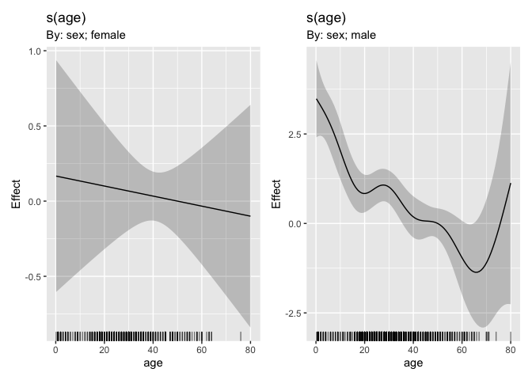<!-- -->

``` r
simpmod %>% 
  smooth_estimates(smooth="s(age)",partial_match=TRUE,overall_uncertainty=FALSE) %>% 
  add_confint() %>% 
  mutate(across(c(est,ends_with("ci")),exp)) %>% 
  mutate(sex=str_remove(smooth,"s\\(age\\):sex")) %>% 
  ggplot(aes(x=age,y=est,ymin=lower_ci,ymax=upper_ci,fill=sex,colour=sex))+
  geom_line()+
  geom_ribbon(alpha=0.3)+
  facet_grid(rows=vars(sex),scales = "free")+
  scale_y_continuous(name="OR vs age 50")+
  theme_minimal()+
  theme(legend.position = "none")
```

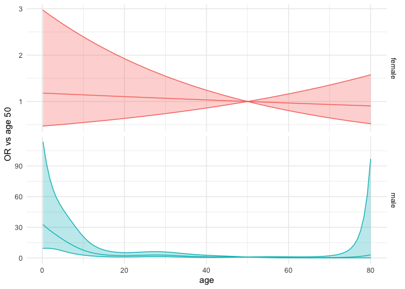<!-- -->

``` r
library(visreg)
visreg_df <- visreg(simpmod,"age","sex",plot = FALSE,trans = exp)
visreg_df$fit %>% 
  ggplot(aes(x=age,y=visregFit,ymin=visregLwr,ymax=visregUpr))+
  geom_line()+
  geom_ribbon(alpha=0.2)+
  facet_wrap(~sex)
```

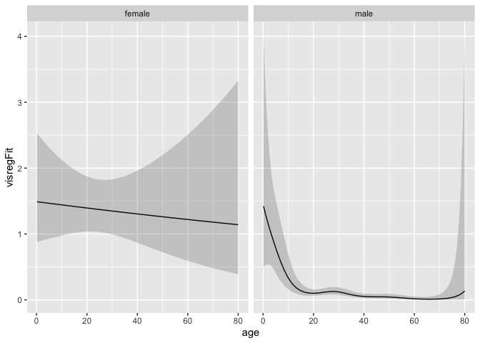<!-- -->

``` r
difference_smooths(simpmod,"s(age)") %>%
  ggplot(aes(x=age,y=diff))+
  geom_line(colour="pink")+
  geom_ribbon(aes(ymin=lower,ymax=upper),alpha=0.2,fill="red")
```

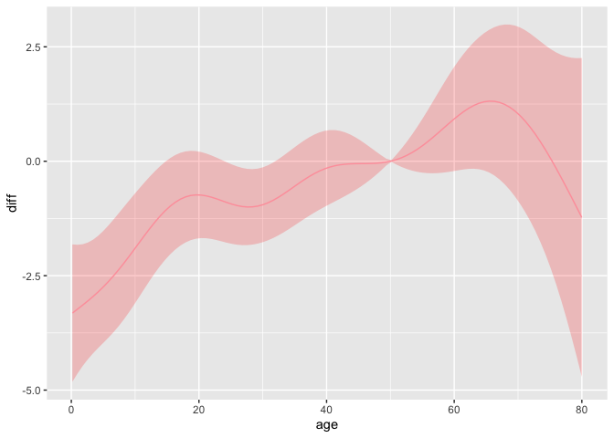<!-- -->

``` r
df %>% 
  modelr::data_grid(sex,passengerClass,age=modelr::seq_range(age,100)) %>% 
  gratia::get_smooths_by_id(
  )
```

    ## NULL

``` r
simpmod %>% 
  confint("s(age)",partial_match = TRUE) %>% 
  mutate(across(c(est,lower,upper),exp)) %>% 
  ggplot(aes(x=age,y=est,ymin=lower,ymax=upper))+
  geom_line()+
  geom_ribbon(alpha=0.2)+
  facet_wrap(~sex)
```

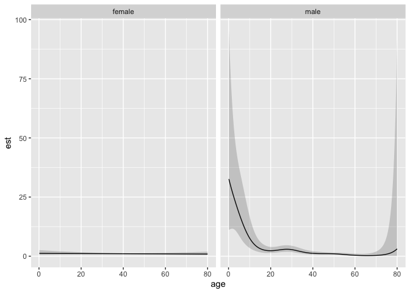<!-- -->

``` r
fmod <- gam(survived~sex+passengerClass+s(age,bs="bs")+s(age,by=sex,bs="bs")+s(age,by=passengerClass,bs="bs"),family = binomial,data = df)
visreg(fmod,"age","sex")$fit %>% 
 ggplot(aes(x=age,y=visregFit,ymin=visregLwr,ymax=visregUpr))+
  geom_line()+
  geom_ribbon(alpha=0.2)+
  facet_wrap(~sex)
```

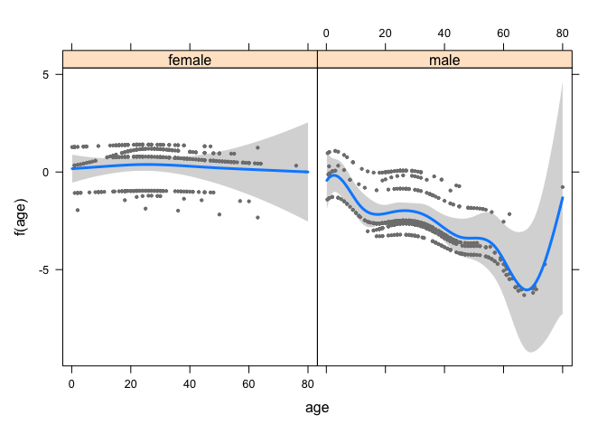<!-- -->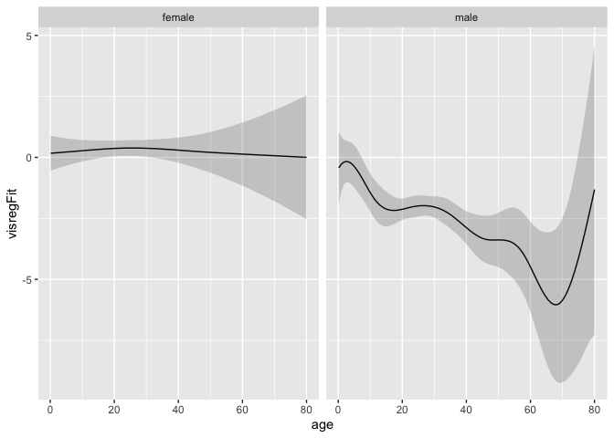<!-- -->

``` r
mod1 <- brm(survived~sex+passengerClass+s(age)+s(age,by=sex)+s(age,by=passengerClass),family = bernoulli,data = df,
            prior = prior(normal(0,1.5),class="b")+
              prior(cauchy(0,1),class="sds"),
            control = list(adapt_delta=0.95),
            file = here("fits","mod1"),
            file_refit = "on_change") # only refits the model when data or formula has changed, otherwise loads from file
get_variables(mod1)
```

    ##   [1] "b_Intercept"                  "b_sexmale"                   
    ##   [3] "b_passengerClass2nd"          "b_passengerClass3rd"         
    ##   [5] "bs_sage_1"                    "bs_sage:sexfemale_1"         
    ##   [7] "bs_sage:sexmale_1"            "bs_sage:passengerClass2nd_1" 
    ##   [9] "bs_sage:passengerClass3rd_1"  "sds_sage_1"                  
    ##  [11] "sds_sagesexfemale_1"          "sds_sagesexmale_1"           
    ##  [13] "sds_sagepassengerClass2nd_1"  "sds_sagepassengerClass3rd_1" 
    ##  [15] "Intercept"                    "s_sage_1[1]"                 
    ##  [17] "s_sage_1[2]"                  "s_sage_1[3]"                 
    ##  [19] "s_sage_1[4]"                  "s_sage_1[5]"                 
    ##  [21] "s_sage_1[6]"                  "s_sage_1[7]"                 
    ##  [23] "s_sage_1[8]"                  "s_sagesexfemale_1[1]"        
    ##  [25] "s_sagesexfemale_1[2]"         "s_sagesexfemale_1[3]"        
    ##  [27] "s_sagesexfemale_1[4]"         "s_sagesexfemale_1[5]"        
    ##  [29] "s_sagesexfemale_1[6]"         "s_sagesexfemale_1[7]"        
    ##  [31] "s_sagesexfemale_1[8]"         "s_sagesexmale_1[1]"          
    ##  [33] "s_sagesexmale_1[2]"           "s_sagesexmale_1[3]"          
    ##  [35] "s_sagesexmale_1[4]"           "s_sagesexmale_1[5]"          
    ##  [37] "s_sagesexmale_1[6]"           "s_sagesexmale_1[7]"          
    ##  [39] "s_sagesexmale_1[8]"           "s_sagepassengerClass2nd_1[1]"
    ##  [41] "s_sagepassengerClass2nd_1[2]" "s_sagepassengerClass2nd_1[3]"
    ##  [43] "s_sagepassengerClass2nd_1[4]" "s_sagepassengerClass2nd_1[5]"
    ##  [45] "s_sagepassengerClass2nd_1[6]" "s_sagepassengerClass2nd_1[7]"
    ##  [47] "s_sagepassengerClass2nd_1[8]" "s_sagepassengerClass3rd_1[1]"
    ##  [49] "s_sagepassengerClass3rd_1[2]" "s_sagepassengerClass3rd_1[3]"
    ##  [51] "s_sagepassengerClass3rd_1[4]" "s_sagepassengerClass3rd_1[5]"
    ##  [53] "s_sagepassengerClass3rd_1[6]" "s_sagepassengerClass3rd_1[7]"
    ##  [55] "s_sagepassengerClass3rd_1[8]" "lp__"                        
    ##  [57] "zs_1_1[1]"                    "zs_1_1[2]"                   
    ##  [59] "zs_1_1[3]"                    "zs_1_1[4]"                   
    ##  [61] "zs_1_1[5]"                    "zs_1_1[6]"                   
    ##  [63] "zs_1_1[7]"                    "zs_1_1[8]"                   
    ##  [65] "zs_2_1[1]"                    "zs_2_1[2]"                   
    ##  [67] "zs_2_1[3]"                    "zs_2_1[4]"                   
    ##  [69] "zs_2_1[5]"                    "zs_2_1[6]"                   
    ##  [71] "zs_2_1[7]"                    "zs_2_1[8]"                   
    ##  [73] "zs_3_1[1]"                    "zs_3_1[2]"                   
    ##  [75] "zs_3_1[3]"                    "zs_3_1[4]"                   
    ##  [77] "zs_3_1[5]"                    "zs_3_1[6]"                   
    ##  [79] "zs_3_1[7]"                    "zs_3_1[8]"                   
    ##  [81] "zs_4_1[1]"                    "zs_4_1[2]"                   
    ##  [83] "zs_4_1[3]"                    "zs_4_1[4]"                   
    ##  [85] "zs_4_1[5]"                    "zs_4_1[6]"                   
    ##  [87] "zs_4_1[7]"                    "zs_4_1[8]"                   
    ##  [89] "zs_5_1[1]"                    "zs_5_1[2]"                   
    ##  [91] "zs_5_1[3]"                    "zs_5_1[4]"                   
    ##  [93] "zs_5_1[5]"                    "zs_5_1[6]"                   
    ##  [95] "zs_5_1[7]"                    "zs_5_1[8]"                   
    ##  [97] "accept_stat__"                "treedepth__"                 
    ##  [99] "stepsize__"                   "divergent__"                 
    ## [101] "n_leapfrog__"                 "energy__"

``` r
mod1 %>% 
  gather_draws(`b_.*`,regex = TRUE) %>% # extracts  draws for parameters
  mutate(or=exp(.value)) %>% # convert to odds ratio scale
  filter(.variable!="b_Intercept") %>% # drop intercept
  ggplot(aes(y=.variable
             ,x=or,
             fill=after_stat(ifelse(x>1,0,1))))+ # fill colour conditional on or over or under 1
  stat_halfeye()+
  theme_tidybayes()+
  theme(legend.position = "none")
```

<!-- -->

``` r
df %>% 
  modelr::data_grid(sex,passengerClass,age=modelr::seq_range(age,n=101)) %>% 
  add_epred_draws(mod1) %>% 
  ggplot(aes(x=age,y=.epred,colour=sex))+
  stat_lineribbon(.width = c(.99, .95, .8, .5), color = "#08519C")+
  facet_grid(rows = vars(passengerClass),cols=vars(sex))+
  scale_fill_brewer()+
  scale_y_continuous(name="Survival probablitiy")+
  theme_tidybayes()
```

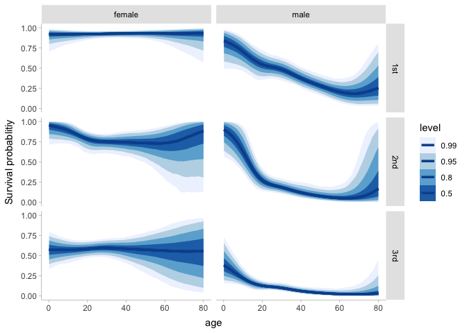<!-- -->

``` r
comp <- df %>% 
  modelr::data_grid(sex,age=modelr::seq_range(age,100),passengerClass) %>% 
  add_epred_draws(mod1,value = "E[y|sex,age,passengerClass]") 
  

# relative risk for women compared to men by age, passengerclass
comp %>% 
  compare_levels(`E[y|sex,age,passengerClass]`,by=sex,fun=`/`) %>% 
  rename("RR"=`E[y|sex,age,passengerClass]`) %>% 
  ggplot() +
  aes(x=age,y=RR) +
  stat_lineribbon(color = "#08519C") +
  geom_hline(yintercept = 0,lty=3)+
  facet_grid(cols = vars(passengerClass)) +
  scale_fill_brewer(name="Confidence level")+
  ggthemes::theme_fivethirtyeight()+
  scale_y_continuous("RR",labels = scales::percent_format())+
  labs(title = "Relative risk for death of women\ncompared to men according to age\nand passenger class on the Titanic")
```

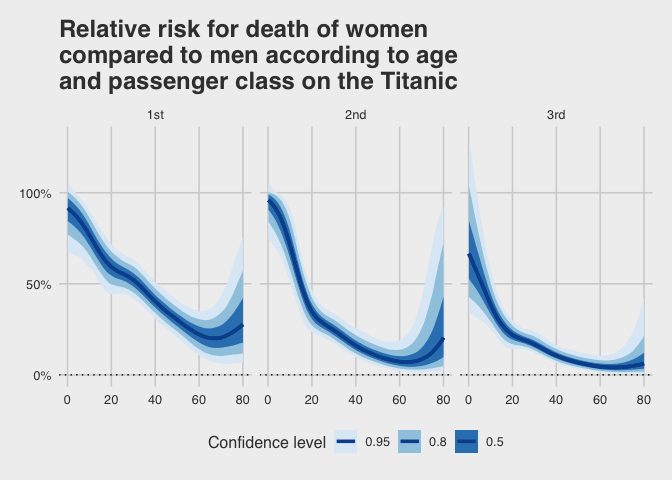<!-- -->

``` r
# relative risk for women compared to men by age, averaged over passengerclass
comp %>% 
group_by(sex,age,.draw) %>% 
summarise(`E[y|sex,age]`=mean(`E[y|sex,age,passengerClass]`)) %>% 
compare_levels(`E[y|sex,age]`,by=sex,fun=`/`) %>% 
  rename("RR"=`E[y|sex,age]`) %>% 
  ggplot() +
  aes(x=age,y=RR) +
  stat_lineribbon(color = "#08519C") +
  geom_hline(yintercept = 1,lty=3)+
  scale_fill_brewer(name="Confidence level")+
  ggthemes::theme_fivethirtyeight()+
  scale_y_continuous()+
  labs(title = "Relative risk of death of women compared\nto men according to age on the Titanic",
       subtitle="Averaged over passenger classes")
```

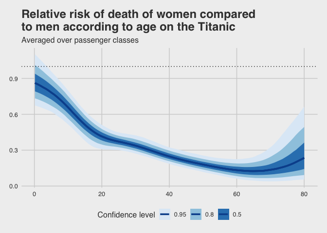<!-- -->

``` r
# absolute risk difference for women compared to men by age, averaged over passengerclass
comp %>% 
  group_by(sex,age,.draw) %>% 
  summarise(`E[y|sex,age]`=mean(`E[y|sex,age,passengerClass]`)) %>% 
  compare_levels(`E[y|sex,age]`,by=sex,fun=`-`) %>% 
  rename("Difference"=`E[y|sex,age]`) %>% 
  ggplot() +
  aes(x=age,y=Difference) +
  stat_lineribbon(color = "#08519C") +
  geom_hline(yintercept = 0,lty=3)+
  scale_fill_brewer(name="Confidence level")+
  ggthemes::theme_fivethirtyeight()+
  scale_y_continuous("AR",labels = scales::percent_format())+
  labs(title = "Absolute risk difference for death of women\ncompared to men according to age on the Titanic",
       subtitle="Averaged over passenger classes")
```

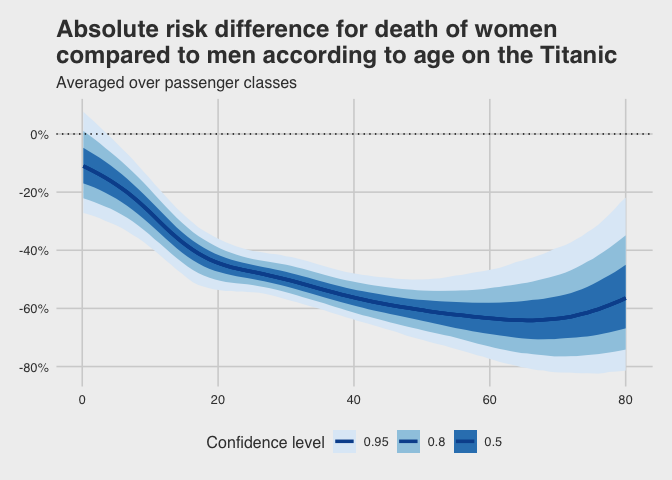<!-- -->
